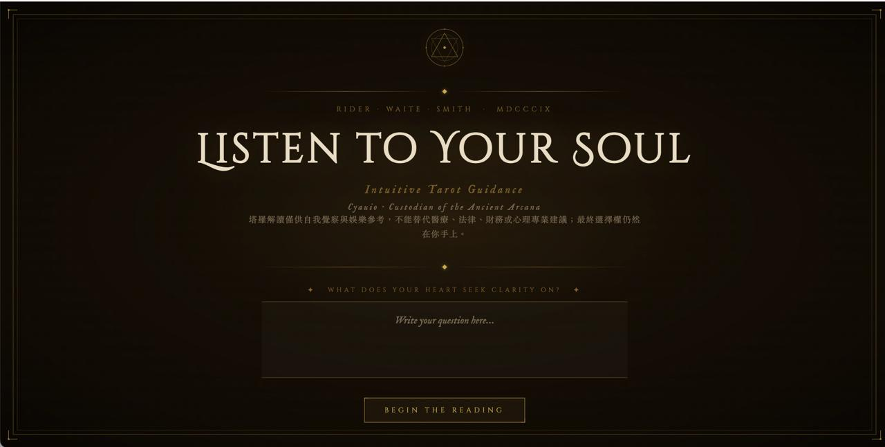
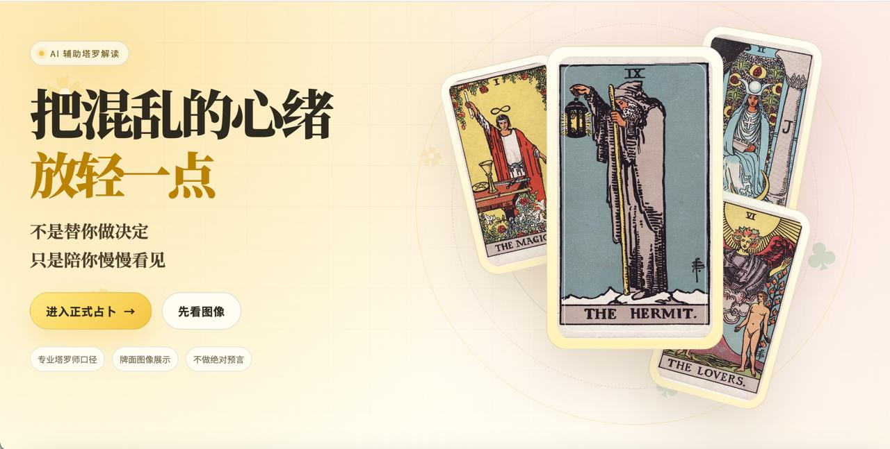
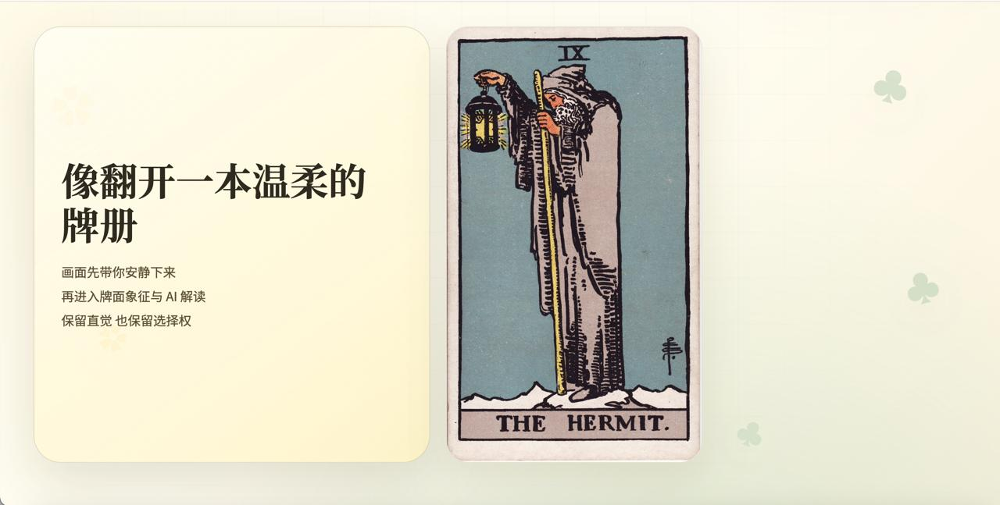
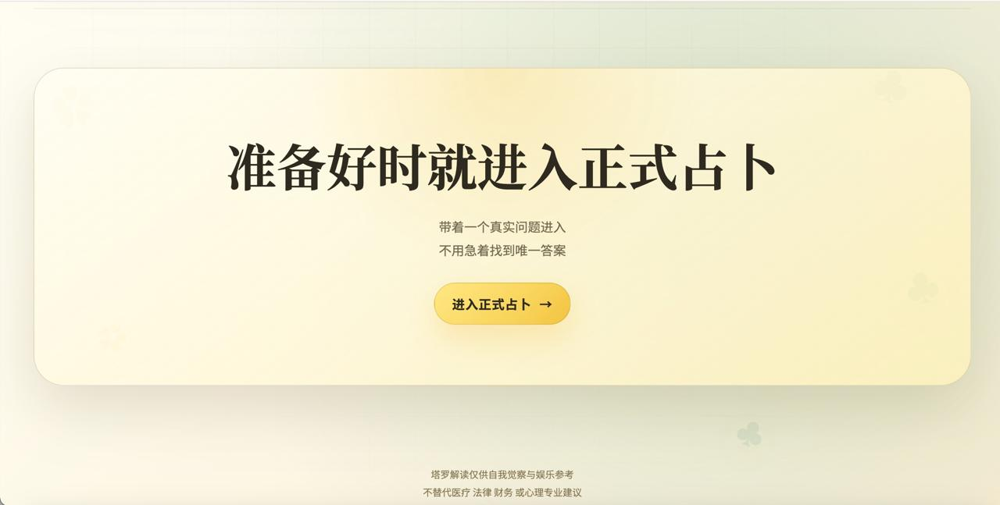
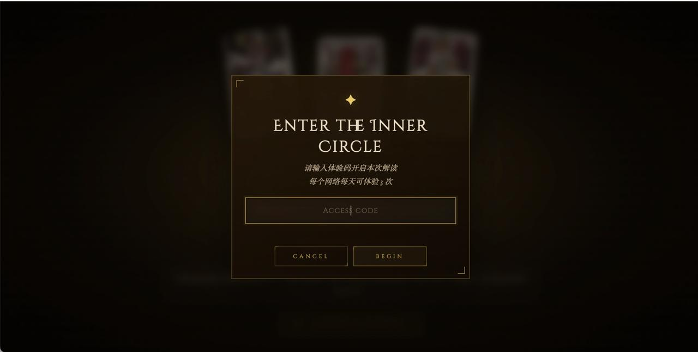

# AI Tarot Reading Web App



An AI-powered tarot reading web application that combines real Rider Waite Smith tarot imagery, user questions, and OpenAI-compatible language model interpretation into a polished web experience.

The project includes a static frontend deployed on Vercel, a Node.js backend deployed on Render, server-side API key protection, access-code based demo control, and per-IP daily rate limiting for safer public sharing.

## Live Demo

- Landing page: https://intuitive-tarot-demo-2.vercel.app/landing.html
- Reading app: https://intuitive-tarot-demo-2.vercel.app/index.html
- Repository: https://github.com/franklinandina141-design/intuitive-tarot-production

> Public demo access is intentionally limited. The demo uses an access code and allows only a small number of readings per IP per day to prevent uncontrolled API usage.

## Screenshot Gallery

### Landing Experience

The landing page introduces the product with a calm, editorial visual language before guiding users into the formal reading flow.







### Reading Experience

The reading interface uses a darker ceremonial style, encouraging users to enter a real question, draw cards, and receive a guided AI interpretation.


### Public Demo Protection

The public demo includes a custom access-code modal and daily rate limiting to reduce uncontrolled API consumption while keeping the project shareable.



## Overview

This project is designed as a complete AI web application rather than a simple static mockup. Users can enter a personal question, draw tarot cards, view real card imagery, and receive a contextual AI-generated interpretation.

The goal is not to make absolute predictions or replace professional advice. Instead, the app frames tarot as a reflective experience: a structured way to explore emotions, choices, and personal clarity with the help of AI-generated language.

## Key Features

- AI-assisted tarot interpretation based on user questions and drawn cards
- Real tarot card image display with fallback handling
- Polished landing page and interactive reading page
- Custom branded access-code modal for public demo control
- Server-side access-code validation
- Per-IP daily rate limiting for cost protection
- Node.js backend proxy for OpenAI-compatible chat completions
- API keys stored only in backend environment variables
- Vercel static frontend deployment
- Render backend deployment
- Production-readiness tests for security and deployment assumptions

## Tech Stack

- HTML
- CSS
- JavaScript
- Node.js
- Vercel
- Render
- GitHub
- OpenAI-compatible API

## Architecture

```text
Browser
  ↓
Vercel static frontend
  ↓
Render Node.js backend proxy
  ↓
OpenAI-compatible model API
```

The browser never receives the model provider API key. All sensitive model calls are routed through the backend proxy.

## Project Structure

```text
.
├── assets/
│   └── landing-preview.jpg
├── public/
│   ├── landing.html      # Landing and product introduction page
│   └── index.html        # Interactive tarot reading app
├── server/
│   └── server.mjs        # Node.js backend proxy
├── tests/
│   └── production-readiness.test.mjs
├── package.json
├── render.yaml           # Render backend deployment config
├── vercel.json           # Vercel static frontend deployment config
└── README.md
```

## Deployment

### Frontend

The frontend is deployed on Vercel as a static site.

Current live frontend:

```text
https://intuitive-tarot-demo-2.vercel.app/
```

Vercel settings:

- Framework Preset: `Other`
- Build Command: `echo 'Static tarot frontend'`
- Output Directory: `public`

### Backend

The backend is deployed on Render.

```text
https://intuitive-tarot-production.onrender.com
```

Health check:

```text
https://intuitive-tarot-production.onrender.com/health
```

Chat endpoint used by the frontend:

```text
https://intuitive-tarot-production.onrender.com/v1/messages
```

## Environment Variables

The backend requires these environment variables:

```bash
HOST=0.0.0.0
SUB2API_API_KEY=your_provider_api_key
SUB2API_BASE_URL=https://api.yksa.uk/v1
SUB2API_MODEL=gpt-5.5
ACCESS_CODE=your_private_demo_access_code
RATE_LIMIT_MAX_PER_DAY=3
ALLOWED_ORIGINS=*
```

Security notes:

- Do not put real API keys in frontend files.
- Do not commit `.env` files to GitHub.
- Keep `SUB2API_API_KEY` only in Render environment variables.
- Keep `ACCESS_CODE` only in Render environment variables.
- The public demo is protected by both an access code and per-IP daily rate limiting.
- The browser calls the project backend only; the backend calls the model provider.

## Local Development

```bash
npm install
export SUB2API_API_KEY='your_provider_api_key'
HOST=0.0.0.0 PORT=8790 npm start
```

Open locally:

```text
http://127.0.0.1:8790/
```

Access from a phone on the same Wi-Fi:

```text
http://your-local-network-ip:8790/
```

## Testing

```bash
npm test
npm run check
```

Current checks cover:

- Frontend does not expose provider API keys
- Frontend defaults to the deployed Render backend
- Tarot image source and fallback logic exist
- Unwanted feedback and tone-switch modules remain absent
- Backend proxies OpenAI-compatible chat completions
- Backend enforces the configured model instead of trusting the browser
- Public demo access code and per-IP daily limit exist
- Branded access-code modal exists instead of a native browser prompt
- Local network access configuration is supported

## Product Highlights

- Complete path from local development to public deployment
- Frontend and backend deployed separately using Vercel and Render
- Backend proxy protects provider API keys from browser exposure
- Access-code and daily rate-limit controls reduce public demo API cost risk
- Realistic portfolio-ready AI application with both UX and deployment considerations
- Automated tests cover key production safety assumptions

## Future Improvements

- Add more tarot spreads and reading modes
- Improve interpretation variety for different question types
- Add multilingual reading support
- Add shareable result cards or downloadable reading images
- Add basic analytics and error monitoring
- Replace in-memory demo rate limiting with a persistent store for larger-scale usage

## Disclaimer

This project is for entertainment, self-reflection, and creative exploration only. It does not provide medical, legal, financial, or psychological advice. Users should make decisions based on their own real-world context and professional guidance when needed.
